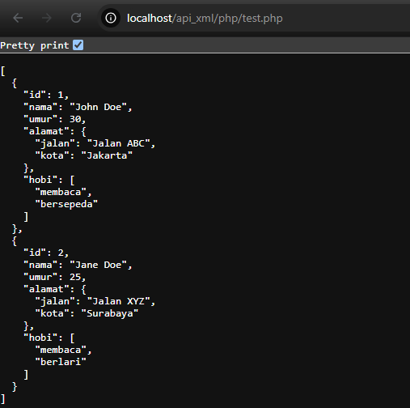

# Praktikum Interoperabilitas dengan JSON dan XML API
## Membuat API dengan JSON menggunakan Node.js

### Tampilan ketika dijalankan

## Membuat API dengan JSON menggunakan PHP

### Tampilan ketika dijalankan

## Membuat API dengan XML menggunakan PHP

### Tampilan ketika dijalankan

## Perintah Post Melalui Postman

## Perintah Delete Melalui Postman

### Data setelah dihapus

# Tugas Praktikum
## Endpoint	GET	di API JSON

## Endpoint	GET	di XML

## Endpoint POST di API JSON

## Endpoint POST di XML

## Convert dari API JSON menjadi XML

### Hasil Ketika dijalankan
